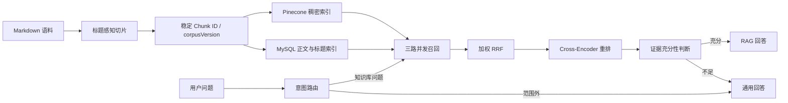

# CodeMemory

CodeMemory 是一个可复现的中文技术知识库 RAG 项目。它实现了 Markdown
标题感知切片、稳定 Chunk ID、Pinecone 稠密检索、MySQL 正文/标题全文检索、
加权 RRF、Cross-Encoder 重排、LangGraph 分支编排以及意图、检索和端到端评测。

仓库自带原创示例语料和示例评测集，不依赖作者本机的私有文档或微调模型即可完成
一次完整演示。

## 架构



## 环境要求

- Node.js 22.18 或更高版本
- pnpm 10 或更高版本
- Docker Compose v2（用于启动仓库自带的 MySQL）
- Ollama
- DeepSeek API Key
- Pinecone Serverless 索引：维度 `1024`，相似度 `cosine`

默认公开演示使用：

- `bge-m3`：Embedding
- `qwen2.5:7b`：意图路由；可以替换为自己的微调模型
- `deepseek-chat`：证据判断与回答
- `onnx-community/bge-reranker-v2-m3-ONNX`：本地重排

## 从零启动

### 1. 安装依赖并配置环境

```bash
pnpm install
cp .env.example .env
```

编辑 `.env`，至少替换：

```dotenv
DEEPSEEK_API_KEY=你的-key
PINECONE_API_KEY=你的-key
PINECONE_INDEX_NAME=你的索引名
```

在 Pinecone 创建维度为 `1024`、相似度为 `cosine` 的 Serverless 索引。
不要提交 `.env`；环境检查只显示变量是否存在，不会打印密钥。

### 2. 准备 Ollama 模型

确保 Ollama 服务已经运行，然后执行：

```bash
ollama pull bge-m3
ollama pull qwen2.5:7b
```

### 3. 启动 MySQL

```bash
pnpm db:up
```

Compose 会在宿主机 `3307` 端口启动 MySQL 8.4，并自动创建
`document_chunks` 表、中文 ngram 全文索引和持久化数据卷。

### 4. 检查服务并构建索引

```bash
pnpm check:env
pnpm bootstrap
```

`bootstrap` 会依次检查 MySQL、Ollama 和 Pinecone，确认全文索引，然后把
`examples/corpus` 中的示例文档切片、向量化并写入 Pinecone 与 MySQL。

### 5. 提问

```bash
pnpm start -- "文档切片为什么需要 overlap？"
pnpm start -- "SSE 经过 Nginx 后不再实时输出应该检查什么？"
```

## 使用自己的语料

把一个或多个 Markdown 文件放进独立目录，并修改 `.env`：

```dotenv
CORPUS_DIR=/absolute/path/to/your/markdown-directory
```

先检查切片数量和语料版本：

```bash
pnpm corpus:version
```

确认后重建：

```bash
pnpm corpus:rebuild
```

`corpus:rebuild` 会替换当前 Pinecone 默认 namespace 和 MySQL 语料表，运行前请确认
目标索引与数据库名称。稳定 Chunk ID 由来源、标题路径和正文共同生成，评测集通过
`corpusVersion` 防止误用旧标签。

## 评测

公开样例与 `examples/corpus` 的 Chunk ID、corpusVersion 完全对应：

```bash
pnpm eval:retrieval:sample
pnpm eval:e2e:sample
```

完整评测说明：

- [检索评测](docs/retrieval-evaluation.md)
- [端到端评测](docs/e2e-evaluation.md)

项目还提供：

```bash
pnpm eval:intent
pnpm eval:intent:base
pnpm test
pnpm typecheck
```

## 常用命令

| 命令 | 用途 |
|---|---|
| `pnpm check:env` | 检查 Node、环境变量和语料目录 |
| `pnpm check:services` | 额外检查 MySQL、Ollama 模型和 Pinecone |
| `pnpm db:up` | 启动并等待 MySQL 健康 |
| `pnpm db:down` | 停止 MySQL，保留数据卷 |
| `pnpm bootstrap` | 服务检查、全文索引初始化和语料重建 |
| `pnpm corpus:version` | 只计算切片数量与 corpusVersion，不写外部存储 |
| `pnpm corpus:rebuild` | 重建 Pinecone 与 MySQL 语料 |
| `pnpm start -- "问题"` | 执行一次完整 LangGraph 问答 |
| `pnpm test` | 运行单元测试 |
| `pnpm typecheck` | 运行 TypeScript 类型检查 |

## 故障排查

### `check:services` 提示缺少 Ollama 模型

模型名必须与 `.env` 完全一致：

```bash
ollama list
ollama pull bge-m3
ollama pull qwen2.5:7b
```

### MySQL 端口冲突

默认映射为 `3307:3306`。如果修改 `compose.yaml` 中的宿主机端口，也要同步修改
`.env` 中的 `DB_PORT`。

### Pinecone 查询报维度错误

`bge-m3` 输出 1024 维向量。确认索引维度为 1024，并确保入库与查询使用相同的
`OLLAMA_EMBEDDING_MODEL`。

### 重排模型首次运行很慢

首次运行需要下载并加载模型。公开配置只重排前 10 个候选、最大长度为 512；评测时
会先预热一次，避免把冷启动时间计入稳态延迟。

## 当前边界

- 公开语料只用于复现链路，不代表正式评测规模。
- 当前索引重建会整体替换数据，不支持在线原子切换。
- 当前入口是 CLI；HTTP/SSE 接口与引用展示仍在后续计划中。
